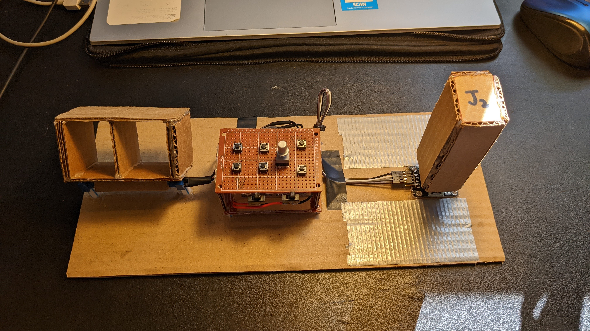

# SimJoystick
An improved configurable cardboard joystick for flight simulators with a stick, control panel, and throttle.

## Description
### How It Works
This cardboard joystick is built by Peter Gutkovich and configurable for any joystick-supporting flight sim. It is a HID-Compliant Device. The joystick consists of a dual-axis stick, an Arduino Micro based control panel, and a throttle. The stick can be used to control roll, pitch, and yaw. The control panel consists of switches, buttons, and toggle buttons that can be assigned to different functions in the flight sim. The throttle can be configured to control airplane engine speed and other factors. 

### Joystick Images

## How To Use the Joystick
The joystick can be connected to your computer via a **micro-usb to usb** cable. The usb connector side should be plugged into the computer usb port and the micro-usb connector side should be plugged into the Arduino Micro. Once the joystick is plugged into your computer, it can be discovered and calibrated. On *Windows, after connecting the joystick the device can be discovered as **"Arduino Leonardo"** in the Control Panel App's **"View Devices and Printers"** section. Then, by right-clicking on the device and clicking "Game Controller Settings" then "Properties", a window will pop-up showing the currently pressed buttons and current throttle/stick values on the joystick. There will be a calibration option in case the joystick isn't working well and needs to be calibrated. Once you open your desired flight sim that has joystick-support, you can confiure the joystick to your liking and fly-away! CLICK **[HERE](Simulation/SimVideos.md)** TO SEE THE JOYSTICK IN ACTION.

## Design and Parts
### Design Hardware
The schematic can be found **[here](Hardware/SimJoystick.sch)** and an image of the schematic can be found **[here](Hardware/SimJoystick.pdf) (NOTE: In the schematic several parts including the Arduino are not the actual parts I used in the final project. To see the actual parts I used click [here]())**. The actual design of the full joystick is pretty arbitrary and I mostly used random dimensions that I made up on the go for cardboard cutouts in the stick, throttle, and control panel. The cardboard base of the joystick is also a random dimenion. You can choose whatever dimensions you want if you choose to build this project but refer to the schematic for wiring. I glued all the parts together with a generic hot glue gun. Parts can be seen in the list below ⬇.

### Parts Required
- Arduino Micro **WITH 32u4 MCU** **(X1)** -> [Amazon Link](https://www.amazon.com/gp/product/B01MTU9GOB/)
- Push Buttons **(x6)** -> [Amazon Link](https://www.amazon.com/gp/product/B07VSNN9S2/)
- 10k Potentiometer **(x2)** -> [Amazon Link](https://www.amazon.com/gp/product/B09G9TBY38/)
- 3-Pin Slide-Switch (Generic) **(x2)**
- 3-Pin Toggle Self-Latching Push Button (Generic) **(x1)**
- Dual-Axis Joystick Module **(x1)** -> [Amazon Link](https://www.amazon.com/gp/product/B089VXPHDH/)
- Wire (Generic)
- Jumper Wires male to female (Generic)
- Pin Headers female to male (Generic)
- Any Thick Cardboard (Generic)
- Some Straws for Support (Generic)

### **JOYSTICK CODE LIBRARY -> [HERE](https://github.com/MHeironimus/ArduinoJoystickLibrary/tree/version-2.0)**
### **SCHEMATIC BASED ON SPARKFUN LIBRARIES -> [HERE](https://github.com/sparkfun/SparkFun-Eagle-Libraries)**
### *Can also be configured for other OS systems and [this](http://mheironimus.blogspot.com/2016/11/arduino-joystick-library-version-20.html) can help
